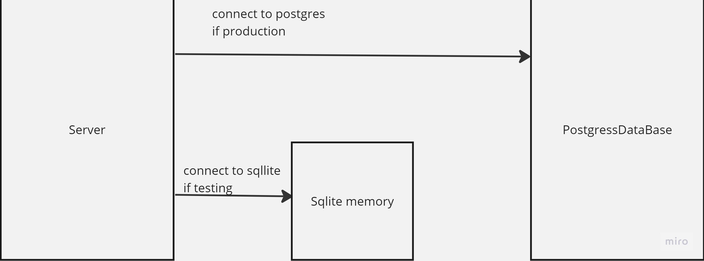

# api-server

## Action Link : https://github.com/Hamzamt99/api-server/actions

## Pull Link : https://github.com/Hamzamt99/api-server/pull/1

## repo link : https://github.com/Hamzamt99/api-server

## live url : https://basic-express-server-btkf.onrender.com

## Uml Diagram :

## notes from instructor during the lecture : 
### 1- we should use sqlite for test and postgresql for production or development.
### 2- we have to use ssl for production.
### 3- we should have test coverage 100%.
### 4- we should start database before testing and drop the connection after finish testing.
